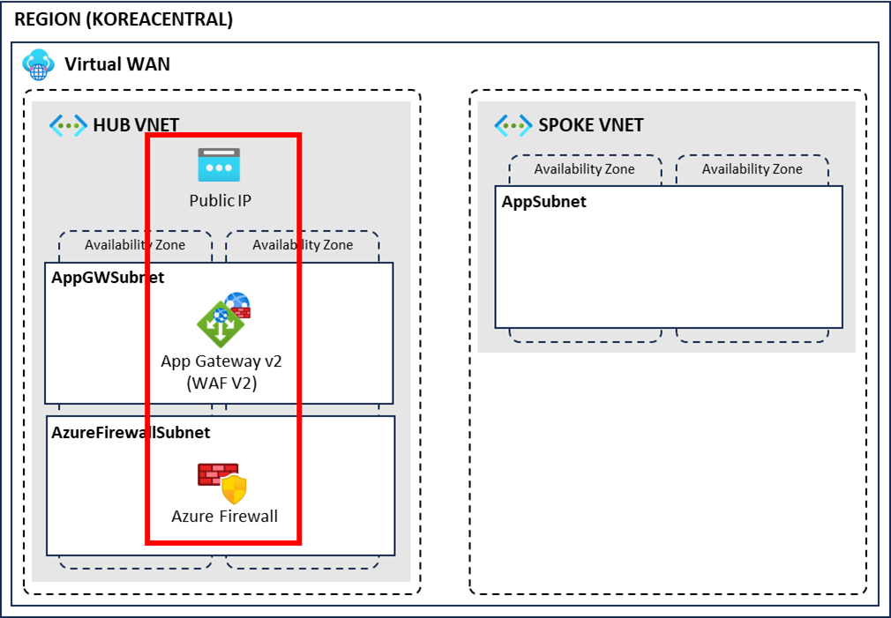

# Security Resource Deploy

## Application Gateway 생성

1. 애플리케이션 게이트웨이 메뉴로 이동합니다.
2. 왼쪽 상단 만들기 버튼을 클릭합니다.
3. 다음과 같이 설정합니다.
    - 구독 : 생성한 구독 선택
    - 리소스 그룹 : azure-intermediate-worshop-rg
    - 게이트웨이 이름 : appGW
    - 지역 : KoreaCentral
    - 계층 : WAF V2
    - 최소 인스턴스 수 : 0
    - 가용성 영역 : 영역 1, 2, 3
    - WAF 정책 : 새로 만들기 클릭
        - 이름 : waf-default-policy
    - 가상 네트워크 : hub-vnet
    - 서브넷 : 서브넷 구성 관리 클릭
        - 서브넷 버튼 클릭
        - 이름 : appgw-subnet
        - 서브넷 주소 범위 : 10.1.1.0/24
        - 저장 버튼 클릭 후, 오른쪽 상단 X 버튼 클릭
        
        
        
4. 다음: 프런트 엔드 > 버튼을 클릭합니다.
5. 프런트 엔드 IP 형식은 `공용` 으로 설정하고 공용 IPv4 주소에서 새로 추가를 클릭합니다.
6. 이름에 `appgwPIP`를 입력하고 확인을 클릭합니다.
    
    
    
7. 다음: 백 엔드 > 버튼을 클릭합니다.
8. 백 엔드 풀 추가를 클릭합니다.
9. 이름에 `backend-pool`을 입력하고 추가를 클릭합니다.
10. 다음: 구성 >버튼을 클릭합니다.
11. 회람 규칙 추가 버튼을 클릭합니다.
12. 다음과 같이 구성하고 추가 버튼을 클릭합니다.
    - 규칙 이름 : http-rule
    - 우선 순위 : 100
    - 수신기
        - 수신기 이름 : http-listener
        - 프런트 엔드 IP : 공용 IPv4
        - 프로토콜 : HTTP
        - 포트 : 80
    - 백 엔드 대상
        - 백 엔드 대상 : backend-pool
        - 백 엔드 설정 : 새로 추가 클릭
            - 백 엔드 설정 이름 : backend-config
            - 나머지 설정 그대로 두고 추가 버튼 클릭
13. 다음: 태그 >, 다음: 검토 + 만들기 > 버튼 클릭 후 구성을 확인하고 만들기 버튼을 클릭합니다.

### WAF 정책 확인

1. WAF(Web Application Firewall) 정책 메뉴로 이동합니다.
2. 생성한 `waf-default-policy`를 클릭합니다.
3. 왼쪽 메뉴에서 관리형 규칙을 선택합니다.
4. 개요에서 `방지 모드로 전환`을 클릭합니다.
5. 할당 버튼을 클릭하고 봇 관리 규칙 집합에서 `Microsoft_BotManagerRuleSet_1.0`을 선택하고 저장 버튼을 클릭합니다.

## 방화벽 배포

### AzureFirewallSubnet 서브넷 추가

1. 가상 네트워크 메뉴로 이동합니다.
2. 생성한 `hub-vnet` 을 선택합니다.
3. 왼쪽 메뉴에서 서브넷을 클릭합니다.
4. 다음과 같이 구성하고 저장 버튼을 클릭합니다.
    - 이름 : AzureFirewallSubnet
    - 서브넷 주소 범위 : 10.1.2.0/26

> AzureFirewallSubnet 서브넷의 크기는 /26입니다.
> 

### 방화벽 배포

1. 방화벽 메뉴로 이동합니다.
2. 왼쪽 상단에 만들기 버튼을 클릭합니다.
3. 다음과 같이 구성하고 다음: 태그 > 버튼을 클릭합니다.
    - 구독 : 생성한 구독 선택
    - 리소스 그룹 : azure-intermediate-worshop-rg
    - 이름 : default-firewall
    - 지역 : Korea Central
    - 방화벽 SKU : 프리미엄
    - Firewall policy : Add new 클릭
        - 정책 이름 : default-fw-policy
    - 가상 네트워크 선택 : 기존 항목 사용
    - 가상 네트워크 : hub-vnet
    - 공용 IP 주소 : 새로 추가
        - 이름 : FWPIP
4. 다음: 검토 + 만들기 > 버튼을 클릭하고 만들기 버튼을 클릭합니다.