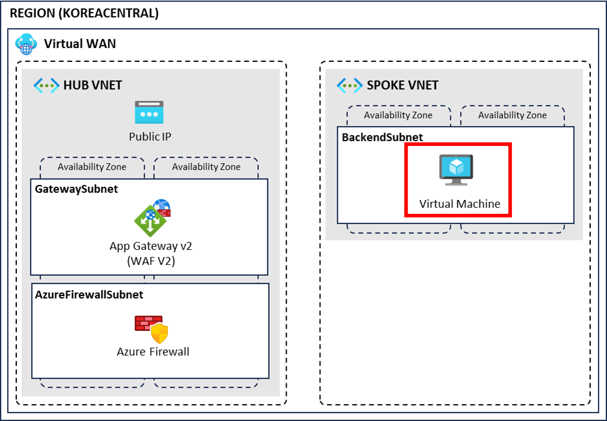

# Test Resource Deploy



## 가상 머신 생성

1. 가상 머신 메뉴로 이동합니다.
2. 왼쪽 상단 만들기 버튼을 클릭합니다
3. 다음과 같이 설정합니다.
    - 구독 : 생성한 구독 선택
    - 리소스 그룹 : azure-intermediate-worshop-rg
    - 가상 머신 이름 : backend-vm
    - 지역 : (Asia Pacific) Korea Central
    - 가용성 영역 : 영역 1
    - 이미지 : Ubuntu Server 20.04 LTS - x64 Gen2
    - 크기 : Standard_D2s_v3
    - 인증 형식 : 암호
        - 사용자 이름 : azureuser
        - 암호 : AzureAdmin123!@
    - 공용 인바운드 포트 : 선택한 포트 허용
    - 인바운드 포트 선택 : SSH (22)
4. 다음: 디스크 > 버튼을 클릭하고, 다음: 네트워킹 > 버튼을 클릭합니다.
5. 네트워킹 탭에서 다음과 같이 설정합니다.
    - 가상 네트워크 : spoke-vnet
    - 서브넷 : app-subnet
    - 공용 IP : (새로 만드는 중) backend-vm-ip
6. 검토 + 만들기 버튼을 클릭하고 만들기 버튼을 클릭합니다.

### 가상 머신 구성

1. 가상 머신이 생성되면 해당 가상 머신 화면으로 이동합니다.
2. 왼쪽 메뉴에서 네트워크 설정을 선택합니다.
3. 네트워크 보안 그룹의 포트 규칙 만들기 버튼을 클릭하고 인바운드 포트 규칙을 선택합니다.
4. 다음과 같이 설정 후 추가 버튼을 클릭합니다.
    - 소스 : Any
    - 원본 포트 범위 : *
    - 대상 주소 : Any
    - 서비스 : SSH
5. 왼쪽 메뉴에서 개요를 선택하고 공용 IP 주소를 기억합니다.
6. 로컬 컴퓨터에서 터미널 프로그램을 실행합니다.
7. 터미널에 아래 명령어를 입력하여 가상 머신에 접속합니다.
    
    ```bash
    ssh azureuser@<공용 IP 주소>
    ```
    
8. 아래 명령어를 입력하여 Nginx를 설치합니다.
    
    ```bash
    sudo apt update
    sudo apt install nginx
    ```